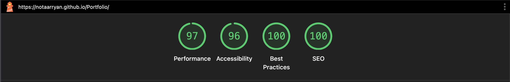

# Aryan Parmar Portfolio Website

Welcome to my personal portfolio website! This site showcases my skills, projects, and accomplishments as a Computer Science student and aspiring Software Engineer.

---

## ⚛️ Migration to React & Modern Web Architecture

This portfolio was originally built as a static site using vanilla HTML, CSS, and JavaScript. It has since been **migrated to a modern React-based architecture**, leveraging component-driven development, state management, and a scalable codebase.

### Why React?

- **Reusable Components:** UI sections are modularized into independent, reusable React components (e.g., `Nav`, `HeroSection`, `MainSection`), making the codebase cleaner and easier to maintain.
- **State Management:** Features like dark/light mode toggling and scroll-to-top button visibility are managed through React state and hooks, enabling responsive, interactive UI updates.
- **Modern Workflow:** The project uses modern tooling (`npm`, JSX, ES6+), and supports hot reloading for a seamless development experience.

### Component Structure

- `App.jsx`: The root component, manages global state (theme, scroll button).
- `Nav.jsx`: Navigation bar with theme toggle.
- `MainSection.jsx`: Main content wrapper.
- `HeroSection.jsx`: Animated hero section with tech stack cards.
- Additional sections and components are easily extendable due to the modular structure.

### Development Workflow

- **Install dependencies** with `npm install`
- **Run locally** with `npm start` (hot reloading enabled)
- **Production builds** are optimized for performance and maintainability.

## 🌐 Live Website

Hosted at: [https://aryanparmarporfolio.vercel.app/](https://aryanparmarporfolio.vercel.app/)

---

## 🚀 Technologies Used

- **React** (component-based UI library)
- **HTML5** (via JSX)
- **CSS3** (custom properties, grid, flexbox, animations, transitions; imported as modules)
- **JavaScript (ES6+)** (functional components, hooks, modular code)
- **Webpack** (modular bundling for production and development)
- **Jest** (unit testing)
- **Babel** (transpiling modern JS/JSX)
- **ESLint** (code linting)

## 🛠️ Skills & Mastery

- Component-driven development with React
- Responsive web design & mobile-first development
- Advanced CSS (variables, grid, flexbox, media queries)
- React hooks for interactivity and state (e.g., theme, scroll events)
- Local storage for theme persistence
- Interactive UI features (card rotation, scroll-to-top button, dark/light mode toggle)
- Modular code structure and maintainability
- Accessibility best practices (semantic HTML, alt tags)
- SEO optimization (meta tags, Open Graph)
- Git & GitHub for version control and deployment

## 📂 Notable Features

- **Dynamic Hero Section:** Animated tech stack cards with smooth transitions (powered by React state and effects)
- **Dark/Light Mode:** Persistent theme toggle with local storage, managed by React
- **Scroll-to-Top Button:** Appears on scroll for improved UX (React state-driven)
- **Projects Showcase:** Live GitHub repository pins with direct links
- **About & Contact Sections:** Education, tech stack, certifications, and social links
- **Mobile Friendly:** Fully responsive layout for all devices
- **Social Sharing:** Open Graph meta tags for rich previews
- **Site Icon:** Favicon and apple-touch-icon for browser and sharing visibility

## 📬 Contact

- [LinkedIn](https://www.linkedin.com/in/aryan-parmar-a0634b299/)
- [GitHub](https://github.com/notaarryan)

---

## 📄 How to Run Locally

### Prerequisites

- Install [Docker Engine](https://docs.docker.com/get-docker/) on your machine to run the app in a container.

1. Clone the repository:
   ```bash
   git clone https://github.com/notaarryan/Portfolio
   ```
2. Build the Docker image:
   ```bash
   docker build -t portfolio:dev .
   ```
3. Run the Docker container:

   To enable **auto-reload on save**, mount your local source code directory as a volume inside the container. This allows the container to detect file changes and reload the app automatically.

   - **For macOS/Linux:**

     ```bash
     docker run -p 5173:5173 -v $(pwd):/app -v /app/node_modules portfolio:dev
     ```

     Here, `$(pwd)` mounts your current directory to `/app` inside the container, and `/app/node_modules` is a separate volume to avoid overwriting container dependencies.

   - **For Windows (PowerShell):**
     ```powershell
     docker run -p 5173:5173 -v ${PWD}:/app -v /app/node_modules portfolio:dev
     ```
     This mounts your current directory and handles `node_modules` similarly to prevent conflicts.

4. Open `http://localhost:5173` in your browser.

## 📊 Lighthouse Score (Desktop)

<p align="center">
  
</p>

- **Performance:** 94
- **Accessibility:** 100
- **Best Practices:** 100
- **SEO:** 100

## 📝 License

This project is open source and available under the MIT License.
