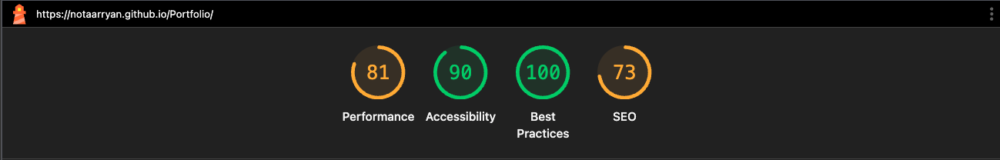

# Aryan Parmar Portfolio Website

Welcome to my personal portfolio website! This site showcases my skills, projects, and accomplishments as a Computer Science student and aspiring Software Engineer.

## 🌐 Live Website

Hosted at: [https://notaarryan.github.io/Portfolio/](https://notaarryan.github.io/Portfolio/)

---

## 🚀 Technologies Used

- **HTML5**
- **CSS3** (including custom animations and transitions)
- **JavaScript (ES6+)**
- **Webpack** (modular bundling for production and development)
- **Jest** (unit testing)
- **Babel** (transpiling modern JS)
- **ESLint** (code linting)

## 🛠️ Skills & Mastery

- Responsive web design
- Advanced CSS (custom properties, grid, flexbox, media queries)
- JavaScript DOM manipulation and event handling
- Local storage for theme persistence
- Interactive UI features (card rotation, scroll-to-top button, dark/light mode toggle)
- Modular code structure and OOP in JS
- Accessibility best practices
- Git & GitHub for version control and deployment

## 📂 Notable Features

- **Dynamic Hero Section:** Animated tech stack cards with smooth transitions
- **Dark/Light Mode:** Persistent theme toggle with local storage
- **Scroll-to-Top Button:** Appears on scroll for improved UX
- **Projects Showcase:** Live GitHub repository pins with direct links
- **About & Contact Sections:** Education, tech stack, certifications, and social links
- **Mobile Friendly:** Fully responsive layout for all devices

## 🏆 Certifications & Achievements

- ICPC Regional Qualifier/Competitor (Nov 2024)
- HackerRank JavaScript (Basic & Intermediate)
- HackerRank Python (Basic)

## 📬 Contact

- [LinkedIn](https://www.linkedin.com/in/aryan-parmar-a0634b299/)
- [GitHub](https://github.com/notaarryan)

---

## 📄 How to Run Locally

1. Clone the repository:
   ```bash
   git clone https://github.com/notaarryan/Portfolio.git
   ```
2. Install dependencies:
   ```bash
   npm install
   ```
3. Start the development server:
   ```bash
   npm start
   ```
4. Open `http://localhost:8080` in your browser.

## 📊 Lighthouse Score (Mobile)

<p align="center">
  
</p>

- **Performance:** 81
- **Accessibility:** 90
- **Best Practices:** 100
- **SEO:** 73

## 📊 Lighthouse Score (Desktop)

<p align="center">
  
</p>

- **Performance:** 96
- **Accessibility:** 90
- **Best Practices:** 100
- **SEO:** 73

## 📝 License

This project is open source and available under the MIT License.
